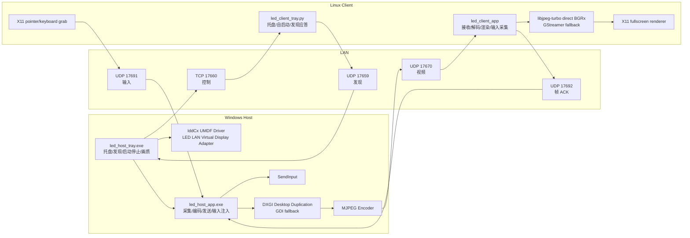

# lan-extended-display

轻量级局域网扩展屏项目。目标是在不依赖账号、云端中继或公网穿透的前提下，让一台 Linux 设备在局域网内作为 Windows 的真实扩展屏使用。

当前阶段已经跑通并持续优化的主链路：

- Windows 主机创建真实虚拟显示器。
- Windows 托盘程序负责发现客户端、启动/停止扩展屏、切换画质和清理残留虚拟屏。
- Linux ARM64 客户端全屏显示 Windows 扩展桌面，并把本地鼠标、键盘输入回传给 Windows。
- 视频链路使用低延迟 MJPEG over UDP，输入链路独立于视频链路。

## 当前状态

已验证环境：

- Windows 11 主机，双物理屏 + 1 个虚拟扩展屏。
- Linux ARM64 客户端，局域网 IP `10.168.20.227`。
- 局域网内可自动发现客户端，也可以在 Windows 托盘菜单手动输入 IP 启动。

已处理的关键体验问题：

- `Start extended display` 后才挂载虚拟屏，停止、异常断开、客户端重启后会尽量移除虚拟屏。
- Windows 锁屏/解锁后，主机端会更稳健地处理捕获中断和恢复。
- Linux 客户端异常断流后不再长期卡在旧画面，服务会回到可重新连接状态。
- 画质可在托盘菜单选择，当前支持 `55`、`75`、`85`、`90`，选择后会自动重启捕获链路生效，不需要手动重启托盘程序。

## 架构



### 组件说明

| 目录/组件 | 作用 |
| --- | --- |
| `common/` | 公共协议、消息、MJPEG 分包、日志和网络辅助代码。 |
| `windows-host/host-ui/led_host_tray.exe` | Windows 托盘入口，负责客户端发现、启动/停止、画质菜单、防火墙规则和日志入口。 |
| `windows-host/host-ui/led_host_app.exe` | Windows 主链路进程，负责虚拟屏采集、MJPEG 编码、UDP 发送、输入注入和连接健康检测。 |
| `windows-host/driver/idd-virtual-display/` | IddCx 虚拟显示驱动，向 Windows 暴露可扩展的虚拟显示器。 |
| `linux-client/client-ui/led_client_app` | Linux 显示端，负责接收视频、解码渲染、采集输入并回传。 |
| `linux-client/client-ui/led_client_tray.py` | Linux 托盘/常驻服务，负责自启动、显示本机 IP、发现应答和启动客户端进程。 |
| `tools/` | 开发期 smoke test 和协议验证工具。 |

## 协议与端口

| 端口 | 协议 | 方向 | 用途 |
| --- | --- | --- | --- |
| `17659` | UDP | Windows <-> Linux | 客户端发现、状态广播。 |
| `17660` | TCP | Windows -> Linux | 控制握手和连接生命周期。 |
| `17670` | UDP | Windows -> Linux | MJPEG 视频分片传输。 |
| `17691` | UDP | Linux -> Windows | 鼠标、滚轮、键盘输入事件。 |
| `17692` | UDP | Linux -> Windows | 帧接收/渲染 ACK，用于延迟和健康检测。 |

## 运行方式

### Windows

推荐通过托盘程序启动：

```powershell
.\build\windows-host\Release\led_host_tray.exe
```

托盘菜单常用项：

- `Start default`：使用默认目标 IP 启动扩展屏。
- `Start by IP...`：手动输入 Linux 客户端 IP。
- `Start discovered client`：从局域网自动发现到的 Linux 客户端里选择。
- `Quality`：切换 JPEG 质量，支持 `55`、`75`、`85`、`90`。
- `Stop extended display`：停止投屏并移除虚拟显示器。
- `Install firewall rules`：安装 Windows 防火墙入站规则。
- `Open log`：打开托盘日志。

主程序也可以单独运行，便于调试：

```powershell
.\build\windows-host\Release\led_host_app.exe --serve-mjpeg-capture 17660 17670 0 60 75 1920 1080 17691 sendinput
```

### Linux ARM64

服务目录通常部署到：

```bash
/home/lzuos/lan-extended-display
```

启动用户服务：

```bash
systemctl --user start lan-extended-display-client.service
```

查看状态和日志：

```bash
systemctl --user status lan-extended-display-client.service
journalctl --user -u lan-extended-display-client.service -f
```

直接运行客户端调试：

```bash
DISPLAY=:0 XAUTHORITY=/home/lzuos/.Xauthority ./led_client_app --receive-mjpeg-stream <windows-host-ip> 17660 0 100 x11-input 17691
```

## 构建

项目使用 CMake 和 C++20。

### Windows

如果 CMake 只在 Visual Studio 开发者环境下可用，可以使用本机 Visual Studio CMake：

```powershell
& "F:\Program Files\Microsoft Visual Studio\18\Enterprise\Common7\IDE\CommonExtensions\Microsoft\CMake\CMake\bin\cmake.exe" -S . -B build\windows-host -G "Visual Studio 18 2026" -A x64 -DLED_BUILD_HOST=ON -DLED_BUILD_CLIENT=OFF -DLED_BUILD_TOOLS=OFF
& "F:\Program Files\Microsoft Visual Studio\18\Enterprise\Common7\IDE\CommonExtensions\Microsoft\CMake\CMake\bin\cmake.exe" --build build\windows-host --config Release
```

驱动构建和签名使用：

```powershell
.\windows-host\driver\idd-virtual-display\scripts\build-sign-package.ps1
```

### Linux ARM64

```bash
cmake -S . -B build-linux-arm64 -DLED_BUILD_HOST=OFF -DLED_BUILD_CLIENT=ON -DLED_BUILD_TOOLS=OFF
cmake --build build-linux-arm64 --config Release
```

建议安装依赖：

```bash
sudo apt-get install -y --no-install-recommends \
  build-essential cmake libx11-dev libxext-dev libjpeg-turbo8-dev python3 python3-pyqt5
```

## 性能数据

以下数据来自当前开发过程中的局域网真机测试，用于描述“目前水平”，不是硬件或协议上限。无线网络、桌面变化幅度、画质档位和 Linux 图形栈都会影响结果。

| 场景 | 观察结果 |
| --- | --- |
| H.264 文件流早期链路验证 | Windows `10.168.20.134` -> ARM64 `10.168.20.227`，13 个 NAL、15 个 RTP 包、0 丢包/乱序/drop、9 个 decoded/raw frame，估算单向耗时约 `42.7ms`，jitter 约 `69us`。 |
| 1280x720@30 早期实时链路 | DXGI/Media Foundation/GStreamer 链路收到 108 个 NAL，0 RTP 丢包/乱序/drop，解码 49 个 `1280x720` raw frame；同轮输入收到 5 个事件，0 malformed/gap/乱序。 |
| 当前 MJPEG 扩展屏链路 | 目标 `1920x1080@60`，支持 dirty region 更新；Linux 端使用 libjpeg-turbo direct BGRx 解码路径，避免 GStreamer JPEG 管线额外排队。 |
| Windows 端资源占用样例 | 任务管理器观察到 `led_host_app.exe` 约 `8% CPU`、`58.9 MB` 内存、约 `4.1 Mbps` 网络、约 `0.1 MB/s` 磁盘显示值。磁盘值主要来自日志/系统统计采样，不是视频写盘。 |
| Linux 端长时间运行样例 | 客户端日志出现过 `frames=46329`、`packets=2475942`、`decoded=39120`、`rendered=39120`、平均帧大小约 `58 KB` 的长跑统计；较低质量档位时平均帧大小约 `38-39 KB`。 |
| 操作响应 | 初期鼠标/键盘存在约 `500ms-1s` 级别可感知滞后；经过本地指针策略、输入独立 UDP 链路、ACK/健康检测和解码路径优化后，当前主观操作已经明显跟手。 |

### 画质与延迟取舍

| 质量 | 建议用途 | 影响 |
| --- | --- | --- |
| `55` | 默认流畅档 | 延迟和带宽压力最低，文字边缘会更容易出现 JPEG 痕迹。 |
| `75` | 平衡档 | 比 `55` 清晰，带宽和 CPU 适中。 |
| `85` | 清晰档 | 文字、图片观感更好，编码/解码和网络压力更高。 |
| `90` | 最高档 | 当前 MJPEG 模式下画质最好，但最容易增加带宽和 CPU。 |

当前主要成本仍在 Windows 端 JPEG 编码和 Linux 端 JPEG 解码/渲染。如果后续要进一步接近“真实外接屏”的观感，优先方向是 GPU 编码/解码链路、低延迟 H.264/HEVC/AV1、或更高效的无损/近无损局部更新策略。

## 设计文档

- [实现方案](lan-extended-display-implementation-plan.md)
- [开发检查清单](docs/development-checklist.md)
- [GUI 与自启动说明](docs/gui-and-autostart.md)
